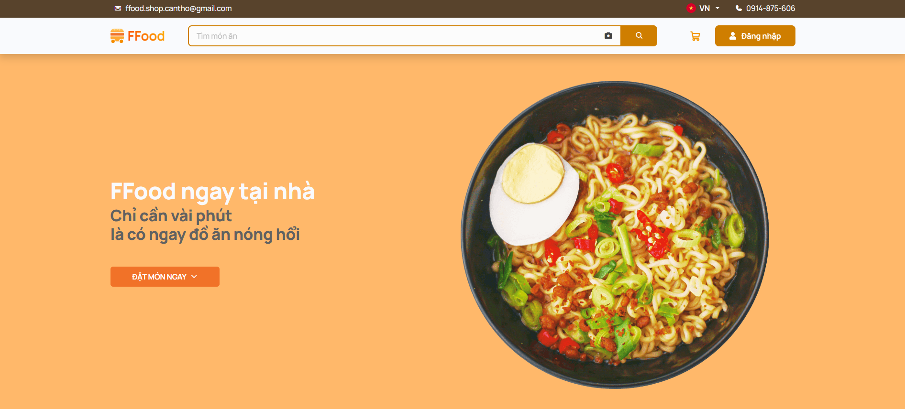

<div align="center">
<h1 align="center">
  <a src="https://github.com/khengyun/FFood-shop">

  </a>
<br>FFOOD-SHOP</h1>
<h3> FFood is a food e-commerce site that lets customers order food in a quick and convenient way.</h3>
<h3>◦ Developed with the software and tools below. ◦</h3>

<p align="center">


</p>


</div>

  

## Project ScreenShots:
  

## Table of Contents

- [Introduction](#introduction)
- [Features](#features)
- [Technologies](#technologies)
- [Installation](#dockerized-project-)
- [License](#license)

## Introduction

FFood is a food website that lets customers order food in a quick and convenient way.

## Features

- Register a User account.
- Log in as a User.
- Log in as a User through a Google account.
- Log in as Employee (Admin, Staff, Promotion Manager)
- Log out.
- View Website information (contact information, location).
- View Food by Categories.
- View Food Details.
- Rate Food.
- Chat bot
- Search Food by keyword.
- Search Food by image.
- User cart Management.
- Payment option.
- Place order as Guest.
- Place order as User.
- Personal User Account Settings.
- View User’s Order History.
- Help menu for Admins.
- Change display language (Ordering System only).
- Display today’s system status.
- View Dashboard.
- View Business Insight.
- Food Management.
- Order Management.
- Promotion and Voucher Management.
- User account Management for Admins.
- Employee role Management (Admin, Staff, Promotion Manager).

## Technologies

- Java SE 1.8 (Java 8)
- JSTL 1.2
- Tomcat 10 (Java EE 7)
- JavaScript ES6
- Bootstrap 5.3.0
- jQuery 3.7.0
- jQuery Validation Plugin
- Docker 24.0.6

### Dependencies

- Jakarta Servlet API (5.0.0)
- Microsoft JDBC Driver for SQL Server (10.2.0.jre8)
- Jakarta Standard Tag Library Implementation (Glassfish)

## Dockerized Project 🚀🚀
1. Install Docker on Window [click here](https://desktop.docker.com/win/main/amd64/Docker%20Desktop%20Installer.exe?_gl=1*3jwbnk*_ga*MTU2MzcwNDM2OS4xNjk3NDU2NjY2*_ga_XJWPQMJYHQ*MTY5NzUyNjQ5Mi44LjEuMTY5NzUyODUxMy40My4wLjA.)
2. Check Docker version after install 
> ```bash
> docker --version
> Docker 24.0.6
>```

3. ``cd`` into the cloned FFood-shop folder
>```bash
>git clone https://github.com/khengyun/FFood-shop.git
>cd FFood-shop
>## Run docker
>docker compose up --build
>```

Now, FFood running locally on your machine at: http://localhost:8080

## License

This project is licensed under the [MIT License](https://github.com/khengyun/FFood-shop/blob/main/README.md).
